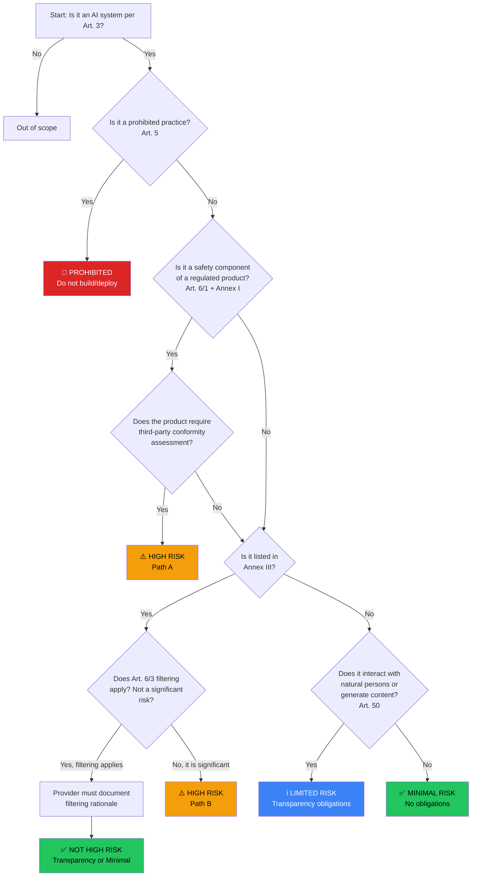

# Risk Classification

> **Relevant articles:** Art. 5, Art. 6, Art. 7, Annex I, Annex III  
> **Related controls:** AISEC-RM-001, AISEC-PH-001 through AISEC-PH-008  
> **Key takeaway:** The entire compliance burden depends on a single question: what risk tier does your AI system fall into?

---

## The risk pyramid

The EU AI Act uses a **risk-based approach**. The higher the risk, the stricter the requirements. There are four tiers:

```
         ┌─────────────┐
         │  PROHIBITED  │  Art. 5 — Banned outright
         │    (Ban)     │  No exceptions (or very narrow ones)
         └──────┬──────┘
                │
        ┌───────┴───────┐
        │   HIGH RISK    │  Art. 6 + Annex III — Full compliance
        │  (Art. 8–15)   │  Risk mgmt, data gov, docs, logging,
        │                │  transparency, oversight, robustness
        └───────┬───────┘
                │
      ┌─────────┴─────────┐
      │   LIMITED RISK     │  Art. 50 — Transparency obligations
      │  (Transparency)    │  Disclose AI interaction, mark synthetic
      │                    │  content, label deep fakes
      └─────────┬─────────┘
                │
    ┌───────────┴───────────┐
    │     MINIMAL RISK       │  No specific obligations
    │    (No obligations)    │  Voluntary codes of conduct
    │                        │  Vast majority of AI systems
    └───────────────────────┘
```

Most AI systems in the EU fall into the **minimal risk** category and have no specific obligations. The regulation's weight falls on the top two tiers.

---

## Tier 1: Prohibited practices (Art. 5)

These AI practices are **banned outright** as of 2 February 2025. Building, deploying, or using them is illegal in the EU.

| Prohibition | Article | Control |
|------------|---------|---------|
| Subliminal, manipulative, or deceptive techniques causing significant harm | Art. 5(1)(a) | AISEC-PH-002 |
| Exploiting vulnerabilities of specific groups (age, disability, economic situation) | Art. 5(1)(b) | AISEC-PH-003 |
| Social scoring by public authorities (or on their behalf) leading to detrimental treatment | Art. 5(1)(c) | AISEC-PH-001 |
| Predictive policing based solely on profiling or personality traits | Art. 5(1)(d) | AISEC-PH-005 |
| Untargeted facial image scraping from internet or CCTV | Art. 5(1)(e) | AISEC-PH-006 |
| Emotion inference in workplace or education (except medical/safety) | Art. 5(1)(f) | AISEC-PH-007 |
| Biometric categorization to infer sensitive attributes (race, political opinions, religion, sexual orientation) | Art. 5(1)(g) | — |
| Real-time remote biometric identification in public spaces for law enforcement (narrow exceptions) | Art. 5(1)(h) | AISEC-PH-004 |
| Non-consensual intimate imagery ("nudifiers") and CSAM generation *(AI Omnibus — effective 2 Dec 2026)* | Art. 5 (Omnibus) | AISEC-PH-008 |

> **AI Omnibus update (May 2026):** The political agreement of 7 May 2026 added an explicit ban on "nudifier" applications — AI systems that generate or manipulate non-consensual intimate imagery of real persons, or that create child sexual abuse material (CSAM). This prohibition takes effect on **2 December 2026**. Providers and Deployers may not place on the EU market AI systems designed for these purposes, or that lack reasonable safeguards against such use.

### What this means for security architects

Your first technical control should be a **prohibited-practice screening check** (control AISEC-PH-001 through AISEC-PH-008). Before any system proceeds through your compliance pipeline, verify it does not fall into a prohibited category. This check should be automated in your CI pipeline and documented in the risk register.

The code implementation lives in `project/risk_management/prohibited_checks.py`.

---

## Tier 2: High-risk AI systems (Art. 6, Annex III)

This is where the regulation has teeth. High-risk AI systems must meet the **full set of requirements** in Articles 8–15 before being placed on the market.

An AI system is high-risk if it meets **either** of two criteria:

### Path A: Safety component of a regulated product (Art. 6(1) + Annex I)

The AI system is intended to be used as a **safety component** of a product covered by specific EU harmonization legislation listed in Annex I, *and* that product is required to undergo a third-party conformity assessment.

This covers AI embedded in:
- Medical devices (MDR 2017/745)
- In vitro diagnostic devices (IVDR 2017/746)
- Machinery (Machinery Regulation 2023/1230)
- Toys (Directive 2009/48)
- Lifts (Directive 2014/33)
- Radio equipment (Directive 2014/53)
- Civil aviation (Regulation 2018/1139)
- Motor vehicles (Regulation 2019/2144)
- Rail systems (Directive 2016/797)
- Marine equipment (Directive 2014/90)

**Timeline:** Under the AI Omnibus political agreement (7 May 2026), these obligations apply from **2 August 2028** — a 12-month postponement from the previously planned August 2027 date. The Omnibus also narrows the "safety component" definition: if an AI component merely assists users or optimises performance without creating health or safety risks, it will not automatically be subject to high-risk obligations. Additionally, AI subject to the Machinery Regulation is **carved out entirely** from the AI Act's direct application.

> **Formal adoption pending:** The Omnibus still requires formal adoption by the European Parliament and Council (expected July 2026). Until published in the Official Journal, plan against both the original and amended timelines.

### Path B: Standalone high-risk systems (Art. 6(2) + Annex III)

The AI system is listed in **Annex III** as a standalone high-risk system. These are systems used in sensitive domains:

| Annex III area | Examples | Applied from |
|---------------|----------|-------------|
| 1. Biometrics | Remote biometric identification (not real-time in public spaces — that's prohibited), biometric categorization, emotion recognition | **2 Dec 2027** |
| 2. Critical infrastructure | Safety components of road traffic, water/gas/heating/electricity supply, digital infrastructure | **2 Dec 2027** |
| 3. Education and vocational training | Determining access to education, evaluating learning outcomes, monitoring student behaviour during tests | **2 Dec 2027** |
| 4. Employment and workers management | **CV screening, candidate ranking, job application filtering**, task allocation, performance monitoring, promotion/termination decisions | **2 Dec 2027** |
| 5. Access to essential services | Credit scoring, insurance pricing, emergency services dispatching, social benefit eligibility | **2 Dec 2027** |
| 6. Law enforcement | Individual risk assessment, polygraphs, evidence reliability, crime analytics (not profiling-only — that's prohibited) | **2 Dec 2027** |
| 7. Migration, asylum, border control | Polygraphs, document authenticity assessment, application assessment, irregular migration risk | **2 Dec 2027** |
| 8. Administration of justice | Researching and interpreting facts and law, applying law to facts | **2 Dec 2027** |

> **Timeline change:** The original AI Act set these dates at 2 August 2026. The AI Omnibus political agreement (7 May 2026) introduced a 16-month postponement to 2 December 2027, giving Providers and Deployers additional time to comply while harmonised standards and guidance are finalised. AI systems placed on the EU market *before* 2 December 2027 will not be subject to high-risk requirements unless they undergo a substantial modification after that date.

> **Our demo project** targets **area 4: Employment** — specifically a CV-screening and candidate ranking system. This is one of the clearest high-risk use cases and is the type of AI system most commonly deployed by mid-to-large enterprises.

### The filtering mechanism (Art. 6(3))

Not every AI system that touches a listed domain is automatically high-risk. Article 6(3) introduces a **filtering mechanism**: an AI system listed in Annex III is **not** high-risk if it does not pose a significant risk of harm to health, safety, or fundamental rights, including by not materially influencing the outcome of decision-making.

This applies when the AI system:
- Performs a narrow procedural task (e.g., converting unstructured data into structured data)
- Is intended to improve the result of a previously completed human activity
- Detects decision-making patterns without replacing or influencing human assessment
- Performs a preparatory task to an assessment relevant for the listed use cases

**Important:** The provider must **document** why the filtering mechanism applies. If a national competent authority disagrees, the system must be treated as high-risk.

---

## Classification decision tree

Use this flowchart to classify any AI system in your portfolio:



### How to read this as a security architect

Walk through this tree for every AI system in your organization's inventory. The output is a **risk classification** that determines:

1. **Which controls apply** — the controls catalog filters by `risk_category`
2. **Which actor obligations apply** — Provider, Deployer, or both
3. **Which timeline applies** — different risk categories have different enforcement dates
4. **What conformity assessment is needed** — internal control (Annex VI) vs. notified body (Annex VII)

The classification should be documented, reviewed periodically, and versioned. It is the first artifact any auditor or competent authority will ask for.

---

## Tier 3: Limited risk — Transparency obligations (Art. 50)

AI systems that don't meet the high-risk threshold but **interact directly with people** or **generate content** must meet transparency requirements:

| Obligation | Applies to | Control |
|-----------|-----------|---------|
| Inform users they are interacting with an AI | Chatbots, virtual assistants, AI customer service | AISEC-TR-002 |
| Mark AI-generated content (audio, image, video, text) in machine-readable format | Content generation systems | AISEC-TR-003 |
| Disclose deep fakes | Systems generating manipulated image/audio/video | AISEC-TR-004 |
| Inform persons exposed to emotion recognition or biometric categorization | Emotion/biometric systems (not prohibited ones) | AISEC-TR-005 |

These obligations apply from **2 August 2026**. However, under the AI Omnibus agreement, generative AI systems already placed on the market or put into service before that date have a 3-month grace period for **watermarking/content labeling** requirements — compliance due by **2 December 2026**. The Commission opened consultation on draft transparency guidelines and a Code of Practice on 8 May 2026.

**Note:** High-risk systems must also meet these transparency requirements *in addition to* the Article 8–15 requirements. The obligations are cumulative, not alternative.

---

## Tier 4: Minimal risk — No specific obligations

The vast majority of AI systems fall here: spam filters, AI-enhanced video games, inventory management, recommendation engines (outside sensitive domains), image enhancement, translation tools, etc.

No specific regulatory obligations apply. The Commission encourages voluntary **codes of conduct** (Art. 95), but they are not legally binding.

---

## Edge cases and practical considerations

### The "general-purpose" question

What if your system is a general-purpose tool that *could* be used in a high-risk domain but wasn't specifically designed for it?

The answer depends on your **intended purpose** (defined in Art. 3(12)). If you market a generic AI tool and a customer uses it for CV screening, you are likely still the Provider of a high-risk system if the intended purpose *encompasses* that use case. If a deployer uses your system for a purpose you explicitly excluded in your instructions for use, they — not you — may assume Provider obligations.

This is why the **instructions for use** (control AISEC-TR-001) are so important: they define the boundary of your responsibility.

### The "GPAI in a high-risk system" scenario

If you build a high-risk AI system on top of a general-purpose AI model (e.g., using GPT-4 or Claude as the backbone of a CV-screening tool):

- The **GPAI model provider** has GPAI obligations (Art. 53)
- **You**, as the Provider of the high-risk system, have the full Article 8–15 obligations
- The GPAI provider must give you sufficient information and documentation (Art. 53(1)(b)) to enable your compliance — but the compliance burden is ultimately yours

This is the exact scenario our demo project implements: a high-risk CV-screening system with an LLM-based résumé summarizer component, demonstrating both GPAI deployer and high-risk Provider obligations simultaneously.

### Multiple risk categories

A single AI system can fall into multiple Annex III categories simultaneously. A system that screens candidates (area 4) and assigns them to training programs (area 3) is high-risk under both. The obligations don't double — they apply once — but you should document both classifications.

---

*Previous: [Scope and Jurisdiction →](scope-and-jurisdiction.md)*
